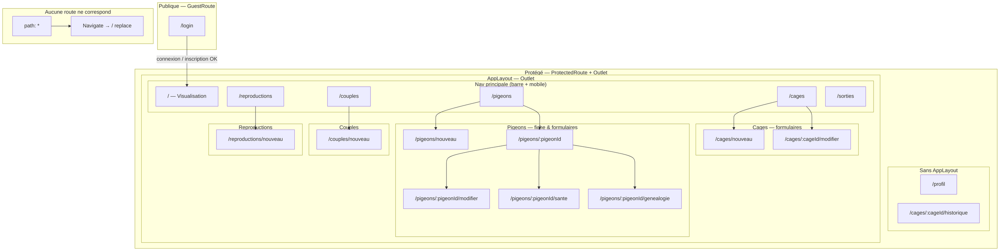

# Architecture technique — Web

## 1. Stack technologique

| Couche                   | Technologie                                | Version indicative (monorepo)    |
| ------------------------ | ------------------------------------------ | -------------------------------- |
| Runtime / UI             | React                                      | 19.x                             |
| Build / dev server       | Vite                                       | 8.x                              |
| Routage                  | React Router DOM                           | 7.x                              |
| Styles                   | Tailwind CSS                               | 4.x (plugin `@tailwindcss/vite`) |
| État client (session UI) | Zustand                                    | 5.x                              |
| Formulaires / validation | react-hook-form, Zod                       | selon `package.json`             |
| Notifications            | react-hot-toast                            | —                                |
| Backend BaaS             | Firebase (Auth, Firestore, option Storage) | SDK 12.x                         |
| Partage code métier      | Package workspace `@shared`                | `packages/shared`                |

Gestionnaire de paquets : **Yarn 4** (workspaces), `nodeLinker: node-modules` (voir `.yarnrc.yml` à la racine).

## 2. Schéma logique (couches)

```
┌─────────────────────────────────────────────────────────┐
│  Navigateur — apps/web (React)                          │
│  Pages · layout · composants · stores (auth UI)         │
└───────────────────────────┬─────────────────────────────┘
                            │ import @shared
┌───────────────────────────▼─────────────────────────────┐
│  packages/shared                                         │
│  services/* · hooks/use* · validators/schemas · types    │
└───────────────────────────┬─────────────────────────────┘
                            │ SDK Firebase
┌───────────────────────────▼─────────────────────────────┐
│  Firebase Auth + Firestore (+ Storage si activé)        │
│  Règles : firebase/firestore.rules (ownerUid)         │
└─────────────────────────────────────────────────────────┘
```

## 3. Arborescence utile `apps/web/src`

| Élément                      | Rôle                                                                                            |
| ---------------------------- | ----------------------------------------------------------------------------------------------- |
| `main.jsx`                   | Point d’entrée React, `BrowserRouter`, styles globaux.                                          |
| `App.jsx`                    | Déclaration des **routes** publiques / protégées.                                               |
| `layout/AppLayout.jsx`       | En-tête, navigation (Volière, Cages, Pigeons, …), filigrane sur six chemins liste, zone `<Outlet />`. |
| `pages/*.jsx`                | Une page par domaine métier (liste, formulaires, fiches).                                       |
| `router/ProtectedRoute.jsx`  | Garde : utilisateur Firebase requis, sinon redirection `/login` avec `state.from`.              |
| `router/GuestRoute.jsx`      | Inverse : invité uniquement ; si déjà connecté → redirection résolue par `postAuthRedirect.js`. |
| `router/postAuthRedirect.js` | Règle « visualisation par défaut » + **retour intelligent** sur routes listées.                 |
| `stores/authStore.js`        | Connexion, inscription, erreurs champs ; appelle services profil partagés si besoin.            |
| `features/voliere/*`         | Grille visualisation, cellule cage, panneau détail, généalogie cage.                            |
| `components/*`               | Composants transverses (chargement, layout, réglages, combobox…).                               |
| `utils/*`                    | CSV, photos locales, etc.                                                                       |

## 4. Routage (table des URLs)

Routes **publiques** :

| URL      | Composant   | Description                                            |
| -------- | ----------- | ------------------------------------------------------ |
| `/login` | `LoginPage` | Onglets Connexion / Inscription / Mot de passe oublié. |

Routes **protégées** : une partie est rendue **sans** `AppLayout` (pas de barre liste / filigrane), le reste sous `AppLayout`.

**Hors `AppLayout`** (navigation minimale selon page) :

| URL | Page |
|-----|------|
| `/profil` | `UserProfileFullPage` — profil, stats, codes volière |
| `/cages/:cageId/historique` | `CageHistoryFullPage` — historique de cage |

**Sous `AppLayout`** (préfixe = racine `/`) :

| URL                             | Page                              |
| ------------------------------- | --------------------------------- |
| `/`                             | `VolierePage` — **Visualisation** |
| `/cages`                        | Liste des cages                   |
| `/cages/nouveau`                | Création cage                     |
| `/cages/:cageId/modifier`       | Édition cage                      |
| `/pigeons`                      | Liste pigeons                     |
| `/pigeons/nouveau`              | Création pigeon                   |
| `/pigeons/:pigeonId`            | Détail pigeon                     |
| `/pigeons/:pigeonId/modifier`   | Édition pigeon                    |
| `/pigeons/:pigeonId/sante`      | Santé                             |
| `/pigeons/:pigeonId/genealogie` | Généalogie                        |
| `/couples`                      | Liste couples                     |
| `/couples/nouveau`              | Nouveau couple                    |
| `/reproductions`                | Liste reproductions               |
| `/reproductions/nouveau`        | Nouvelle reproduction             |
| `/sorties`                      | Sorties                           |

Route **catch-all** : toute autre URL → redirection `/`.

## 5. Intégration `packages/shared`

Vite résout l’alias **`@shared`** vers `../../packages/shared` (voir `apps/web/vite.config.js`).

Rôles typiques du partagé :

- **`firebase/authClient`**, **`firebase/config`** : initialisation client (variables injectées via `define` Vite pour compatibilité avec le code partagé Expo).
- **`services/*`** : CRUD et règles métier (cages, pigeons, couples, reproductions, sorties, profil utilisateur).
- **`hooks/useCages`**, **`usePigeons`**, **`useCouples`**, etc. : abonnements Firestore temps réel (`onSnapshot`). `useCouples(true)` restreint aux couples **ACTIF** côté client.
- **`utils/pigeonCsv`** : en-têtes et génération de lignes CSV pigeons (web + mobile).
- **`validators/schemas`** : schémas Zod alignés sur les documents Firestore.

Ainsi, la **logique métier sensible** (cohérence cage / couple / pigeon) reste centralisée et testable (cf. Vitest sur `packages/shared`).

## 6. Fichiers d’environnement et build

Les clés Firebase côté client sont fournies par **`VITE_*`** dans `apps/web/.env.local` (voir `.env.example`). Vite les expose au bundle ; ne jamais committer `.env.local`.

Le build de production : `yarn workspace web build` (ou équivalent depuis `apps/web`) → sortie dans **`dist/`** (ignoré par Git).

## 7. Diagramme de navigation (complet)

Schéma aligné sur **`apps/web/src/App.jsx`** : toutes les routes déclarées, regroupement **publique** / **protégée hors layout** / **AppLayout**, plus la **catch-all** `* → /`.



- **`/profil`** et **`/cages/:cageId/historique`** : même session que le reste, mais **sans** en-tête / nav du layout liste (voir **§ 4**).
- **Flèches « nav → route »** : parcours usuel ; toute URL **AppLayout** reste accessible directement par URL (bookmark, retour intelligent après auth — `postAuthRedirect.js`).
- **`*`** : toute URL non reconnue redirige vers **`/`** (composant `Navigate`).

Tableau **URL → composant** : **§ 4**.

---
