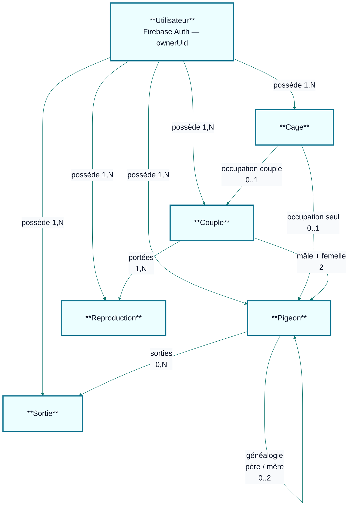

# Conception produit et données

Document de synthèse (conception + persistance) « gestion de volière » et les règles métier.

## 1. Objectifs

- Digitaliser l’élevage (pigeons, couples, reproductions, sorties, cages).
- Offrir une **visualisation virtuelle** des cages (grille, codes couleur, actions au clic).
- Assurer la **traçabilité** (généalogie, sorties) et des **règles métier** non contournables côté services.

## 2. Règles métier (rappel opérationnel)

| Règle | Description |
|--------|-------------|
| Pigeon | Identifiant unique (matricule / bague), statuts ACTIF, VENDU, MORT, PERDU. Pas de suppression physique si descendants (soft delete). |
| Couple | Exactement un mâle et une femelle, tous deux actifs, pas déjà dans un couple actif. Un seul couple actif par pigeon. |
| Cage | État LIBRE, OCCUPE_PIGEON (un pigeon seul), OCCUPE_COUPLE (un couple). Jamais pigeon + couple simultanément. |
| Sortie | Retire le pigeon de l’effectif « en volière », met à jour statut pigeon, libère cage / rompt couple si besoin. |
| Reproduction | Liée à un couple ; enregistrement des jeunes avec lien de filiation (`pereId` / `mereId`). |

## 3. MCD (entités et cardinalités)

```
Utilisateur (1) — (N) accès application [Auth Firebase, hors MCD métier détaillé]

Pigeon (1) — (0..1) Cage        [via cage.pigeonId quand statut OCCUPE_PIGEON]
Couple (1) — (0..1) Cage        [via cage.coupleId + couple.cageId quand OCCUPE_COUPLE]

Couple (1) — (2) Pigeon         [maleId, femelleId]
Couple (1) — (N) Reproduction

Pigeon (0..2) — Pigeon          [pereId, mereId — généalogie]
Sortie (N) — (1) Pigeon         [pigeonId]
```

Vue équivalente en **diagramme** (Mermaid). Si le rendu reste petit dans ton IDE, ouvre le fichier sur **GitHub**, utilise le **zoom** du navigateur, ou colle le bloc sur [mermaid.live](https://mermaid.live) pour exporter une image.



Cardinalités clés : une **cage** référence au plus un **pigeon seul** OU un **couple** ; un **pigeon actif** ne peut être logé que dans **au plus une cage** à la fois (contrôlé dans les services).

## 4. Architecture technique

- **Frontend web** : React 19 + Vite + Tailwind CSS 4, React Router, Zustand (session UI), react-hot-toast.
- **Frontend mobile** : React Native + Expo (~54), Expo Router ; réutilise les mêmes services et hooks via `packages/shared`.
- **Données** : Firebase (Firestore, Auth, Storage), client/serveur via SDK Firestore (temps réel `onSnapshot`).
- **Partagé** : `packages/shared` (types, services métier, hooks Firestore, schémas Zod).

**Couples (ACTIF / ROMPU)** : les documents `couples` portent un **statut**. Les listes et sélecteurs orientés « action courante » (nouveau couple, reproduction, sortie, etc.) ne chargent en principe que les couples **`ACTIF`** via `useCouples(true)`. Les écrans d’historique ou la visualisation volière peuvent nécessiter **`useCouples(false)`** pour résoudre un id ou afficher des couples rompus.

## 5. Modèle Firestore (collections)

| Collection | Document | Champs principaux |
|------------|----------|-------------------|
| `pigeons` | `{id}` | matricule, sexe, race, dateNaissance, statut, pereId, mereId, photo, notes, deletedAt, timestamps |
| `couples` | `{id}` | maleId, femelleId, dateDebut, dateFin, **statut** (`ACTIF`, `ROMPU`), cageId, notes, createdAt |
| `cages` | `{id}` | numero, nom, superficie, description, statut, pigeonId, coupleId, voliereCode (optionnel, ex. `A`), timestamps |
| `reproductions` | `{id}` | coupleId, dates, nombres, pigeonneauxIds, notes |
| `sorties` | `{id}` | pigeonId, type, date, prix, acheteur, cause, circonstance, notes |

**Index** : combinaisons `where` + `orderBy` sur une même collection peuvent nécessiter des index composites (console Firebase → lien d’erreur automatique).

**Historique cage (évolution)** : première version UI avec section « Historique » prête à être branchée sur une sous-collection `cages/{id}/evenements` ou collection `cage_events` (à ajouter lors de la itération suivante).

## 6. Correspondance visualisation (PDF § 3.7)

| État cage | Couleur UI | Source |
|-----------|------------|--------|
| LIBRE | Vert | `statut === 'LIBRE'` |
| OCCUPE_PIGEON | Rouge | un pigeon seul |
| OCCUPE_COUPLE | Orange | couple référencé par `coupleId` |

---